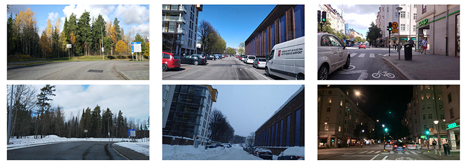

# Data

## Mapillary Street Level Sequences Data

Models trained on both `DL1` and `P3` instances use a subset of the Mapillary Street-Level Sequences dataset (MSLS). Mapillary, a subsidiary of Facebook, primarily provides a platform for crowd-sourced maps and street-level imagery. This dataset is available for download [here](https://www.mapillary.com/dataset/places).

In total, MSLS contains ~1.6 million images from 30 major cities on six-continents. In general, image sizes range from 256x256 to 640x480. Because the original DCGAN paper expects 64x64 images, these images gave me leeway to apply cropping, down-scaling, and multiple translations to almost all images in the sample.

The model presented here was trained on a sample of the MSLS using images from only the United States. The approximate distribution by metro area is below:

| City      | Size     | Imgs   |
|-----------|----------|--------|
| Austin    | 761.5 MB |  28462 |
| bangkok   | 1.2 GB   |  40125 |
| budapest  | 1.7 GB   |  45800 |
| helsinki  | 721.3 MB |  15228 |
| london    | 265.4 MB |   5983 |
| manila    | 219.0 MB |   5378 |
| melbourne | 6.3 GB   | 189945 |
| moscow    | 4.9 GB   | 171878 |
| paris     | 344.2 MB |   9503 |
| phoenix   | 3.4 GB   | 106221 |
| saopaulo  | 1.2 GB   |  35096 |
| sf        | 174.6 MB |   4525 |
| trondheim | 207.5 MB |   4136 |
| zurich    | 113.8 MB |   2991 |

### Supplemental Links & Citation

- [Publication](https://research.mapillary.com/publication/cvpr20c)
- [Release Notes](https://blog.mapillary.com/update/2020/04/27/Mapillary-Street-Level-Sequences.html)

**[1]** *F. Warburg, S. Hauberg, M. Lopez-Antequera, P. Gargallo, Y. Kuang, and J. Civera. Mapillary Street-Level Sequences: A Dataset for Lifelong Place Recognition. In Conference on Computer Vision and Pattern Recognition (CVPR), 2020*