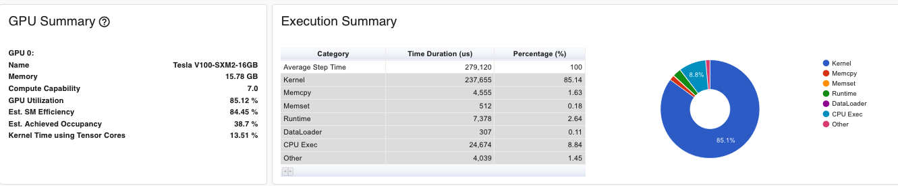
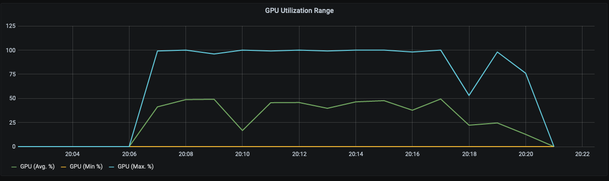
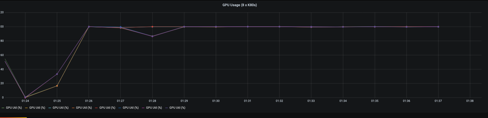
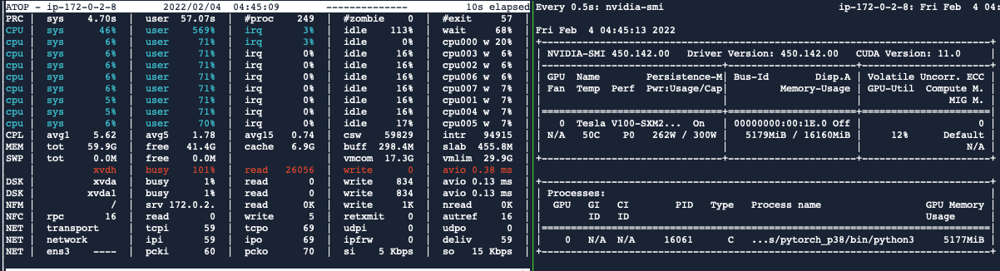
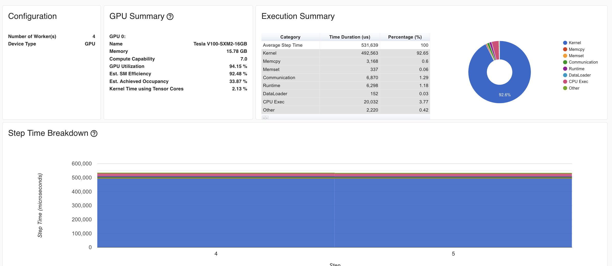

I haven't written a line of ML code since 2014 (and I could even argue that didn't count). I wanted to develop a sense of what model training on modern GPUs is like, and then, once I was ready with a model that worked on the GPU, migrate it to the HPU. If you're just interested in comparative results, you can skip to [performance results](#Comparative%20Performance).

## Selecting a Comparable GPU Instance

Using [instances.vantage.sh](https://instances.vantage.sh/), I aggregated data for GPU instances available in `us-east-1` with between 2 and 8 GPUs. I relied exclusively on Nvidia's most recent [resnext-101 benchmarks](https://developer.nvidia.com/deep-learning-performance-training-inference) as a proxy for my model's performance. On price, `p3.8xlarge` instances are the most similar to the `DL1` and offer 4 `V100` GPUs, making them an obvious choice for comparative analysis.

| API Name      | Memory (GiB) | VCPUs | GPUs | GPU Model             | GPU Mem (GiB) |   $/Hr |
|---------------|--------------|-------|------|-----------------------|---------------|--------|
| **p2.xlarge**     |          **61**  |     **4** |    **1** | **NVIDIA Tesla K80**      |            **12** |   **0.90** |
| g3.8xlarge    |          244 |    32 |    2 | NVIDIA Tesla M60      |            16 |   2.28 |
| **p3.2xlarge**   |          **61** |    **8** |    **1** | **NVIDIA Tesla V100**     |            **16** |  **3.06** |
| g4dn.12xlarge |          192 |    48 |    4 | NVIDIA T4 Tensor Core |            64 |   3.91 |
| g3.16xlarge   |          488 |    64 |    4 | NVIDIA Tesla M60      |            32 |   4.56 |
| g5.12xlarge   |          192 |    48 |    4 | NVIDIA A10G           |            96 |   5.67 |
| **p2.8xlarge**    |          **488** |    **32** |    **8** |**NVIDIA Tesla K80**      |            **96** |   **7.20** |
| g4dn.metal    |          384 |    96 |    8 | NVIDIA T4 Tensor Core |           128 |   7.82 |
| g5.24xlarge   |          384 |    96 |    4 | NVIDIA A10G           |            96 |   8.14 |
| **p3.8xlarge**   |          **244** |    **32** |    **4** | **NVIDIA Tesla V100**     |            **64** |  **12.24** |
| g5.48xlarge   |          768 |   192 |    8 | NVIDIA A10G           |           192 |  16.29 |
| p3.16xlarge   |          488 |    64 |    8 | NVIDIA Tesla V100     |           128 |  24.48 |
| p3dn.24xlarge |          768 |    96 |    8 | NVIDIA Tesla V100     |           256 |  31.21 |
| p4d.24xlarge  |         1152 |    96 |    8 | NVIDIA A100           |           320 |  32.77 |
Table: Table 1.1 - Possible Comparable GPU Instances

I also ran short-lived tests on the  `p2.xlarge`, `p2.8xlarge` and `p3.2xlarge` to help me develop a mental model of DDP patterns and performance. 

## Evaluating a First Training run on GPU Instances

I started with a PyTorch model running on a GPU (`P3.2xlarge` w. `V100`) before instrumenting it to run on the HPU. I wanted to make sure that I could do a fair comparison of the two, and that meant ensuring I was optimizing (within reason) for either platform. To validate that the model was sufficiently tuned for the GPU, I referred to the metrics generated by running my model in profiler mode, instance metrics sent to Grafana, and those produced by `nvidia-smi` (see: [nvidia-smi](https://developer.nvidia.com/nvidia-system-management-interface)). With these metrics available, I was able to make the following choices to improve the model's training performance.

- **Upgrade EFS to EBS** &mdash; Regrettably, an EFS file system can only drive up to 150 KiB/s per GiB of read throughput. This meant that model training start-up was very, very slow. To alleviate this issue, I attached a `gp3` (8000 iops, 1000 MiB/s) volume to my training instance and used it to "host" the MSLS data. Anecdotally, this choice led to a *2000%* speed up in time until first training iteration. Although EBS is more expensive, the decision paid for itself by saving hours of idle GPU/HPU time.

- **Increase Batch Size** &mdash; This was low-hanging fruit. Independent of the other changes, the right choice of batch size (i.e. 1024 instead of 128) sped up overall execution time by ~80%.

- **Minimize (obvious) CUDA Copies** &mdash; Training statistics, outputs, labels, etc. were being haphazardly moved to and from the GPU! I can collect and display them at the end of the epoch rather than on each batch.

- **Using AMP** &mdash; Automatic Mixed Precision (AMP) allows for model training to run with FP16 values where possible and F32 where needed. This allows for lower memory consumption and faster training time. It also opens the door for me to use Habana's mixed precision [modules](https://docs.habana.ai/en/latest/PyTorch_User_Guide/PyTorch_User_Guide.html#pytorch-mixed-precision-training-on-gaudi) when I move over to the `DL1` instance.

- **Distributed Data Processing** &mdash; In isolation, distributed data processing doesn't improve the model's training performance, but it does lend towards a more robust training environment. Although this is a problem that uses a moderate amount of small images, I still wanted to instrument my code to run across multiple GPUs (and nodes).

With these changes made, I was hoping that I was in a good place. Looking at the first chart below, *PyTorch Profiler - GPU Execution Summary*, it would seem I was doing quite well, 85% is OK GPU performance! Unfortunately, the second graph reveals a fundamental problem in my profiling strategy at the time. The sections profiled didn't include the dataloader steps!

|                           |
|:-------------------------:|
| *Figure 1.1 - PyTorch Profiler - GPU Execution Summary* |
|  |

|                           |
|:-------------------------:|
| *Figure 1.2 - Grafana - GPU Utilization Rates* |
|  |

At this point things got quite difficult. I tried tweaking the number of dataloader workers and their pre-fetch factors, no luck. I tried generating an hd5 dataset from my images and writing my own dataloader, again, no luck. I even tried installing a [SIMD fork of PIL](https://github.com/uploadcare/pillow-simd) to increase image processing performance. Unfortunately, none of it made a meaningful difference on the `V100`. I strongly suspected it was the dataloader code that was the bottleneck and did a few sanity checks to make sense of things.

Every batch is doing thousands of `PIL.open()` calls ([source](https://github.com/pytorch/vision/blob/main/torchvision/datasets/folder.py#L245-L249)). If these calls are causing the slowdown, we should be able to construct an experiment to test it. I tried the following exercises to help me understand resource usage during the training process.

- **Let's just use a worse GPU!** &mdash; I spun up a `p2.8xlarge` with older `K80`s to see if the weaker GPUs would produce nicer utilization metrics. In theory, if the GPU is the bottleneck instead of the dataloader, I won't see these periodic dips. This is a bit of a vanity metric and I have no interest in doubling my training costs for vanity's sake, but the charts below confirm my hypothesis. This was an excellent discovery!

|                           |
|:-------------------------:|
| *Figure 2.1 - GPU Training - GPU Usage - P2.8xLarge* |
|  |

- **Let's make sure it's really the disk?** &mdash; Back on the `p3.2xlarge`, I figured I should profile the disk to see what was going on during the utilization drops. I thought a maxed-out `gp3` would have been adequate, but maybe I should have sprung for the `io1` or `io2`. In *Figure 2.2 - GPU Training - atop + Nvidia SMI Profile* , you can see the results of `atop` and `nvidia-smi` during a training run. When the GPU is at low utilization. the disk where `MSLS` is mounted (`/dev/xvdh`) is **working!**.

|                           |
|:-------------------------:|
| *Figure 2.2 - GPU Training - atop + Nvidia SMI Profile* |
|  |


- **Two Birds, One Stone** &mdash; I was struggling with the relative performance of the GPU and disk, rather than using a worse GPU, why not make a more robust model? If I increase the feature depth of the model, I can probably get the GPU's utilization up, high efficiency, and a model that converges more reliably! I quadrupled the size of the networks and ran a short test that yielded very satisfying results.

|                           |
|:-------------------------:|
| *Figure 2.3 - GPU Training - Distributed Training on Larger Model* |
|  |
  

Thinking about it in retrospect, this all makes sense. We're opening images that are `(3 x 360 x 480)` and the loader is doing some light calculations to resize and re-color them, but then the GPU is running the expensive operations on images that are just `(3 x 64 x 64)`.

I later did some research into [GPU profiling](https://pytorch.org/blog/pytorch-profiler-1.9-released/) and learned that GPU utilization is a coarse metric and I was probably already in a OK place from a performance perspective given my `Est. Achieved Occupancy` was OK this entire time<sup>1</sup>. Regardless, very enjoyable set of experiments. Finally, I did a few short test-runs to collect metrics (`p2.8xlarge` w. 8 x `K80`, `p3.2xlarge` w. 1 x `V100`, `p3.8xlarge` w. 4 x `V100`) and I moved along to training on the Gaudi-accelerated instances. (See: [Performance Results](#Comparative%20Performance))

--------

## Modifications for Training on Gaudi Accelerated Instances

Migrating a model to run on HPUs require some changes, most of which are highlighted in the migration [guide](https://docs.habana.ai/en/latest/Migration_Guide/Migration_Guide.html#porting-simple-pyt-model). In general, a few changed imports allow the PyTorch Habana bridge to drive the execution of deep learning models on the Habana Gaudi device. Specifically, I made the following changes for the Gaudi accelerated instances:

- **Use the custom Habana DataLoader** &mdash; Under the right [circumstances](https://docs.habana.ai/en/v1.1.0/PyTorch_User_Guide/PyTorch_User_Guide.html#habana-data-loader), `HabanaDataLoader` can yield better performance that the native `DataLoader`. Even without acceleration, `HabanaDataLoader` still will fall back to the standard loader.

- **Use Local NVME Storage Instead of EBS** &mdash; I *just* noted that the dataloader was potentially a bottleneck in my training process. Instead of training of of EBS, when training the model on `DL1`, I trained off of the [ephemeral storage volumes](https://aws.amazon.com/ec2/instance-types/dl1/) that come with the instance. Test results in [Performance Results](#Comparative%20Performance)

- **Use `Lazy Mode`** &mdash; [Lazy Mode](https://docs.habana.ai/en/v1.1.0/PyTorch_User_Guide/PyTorch_User_Guide.html#lazy-mode) provides the SynapseAI graph compiler the opportunity to optimize the device execution for multiple ops.
  
- **Use `FusedAdamW` over `AdamW`**  &mdash; `FusedAdamW` is a custom `AdamW` implementation for Habana devices that can batch the element-wise updates applied to all the model’s parameters into one or a few kernel launches rather than a single kernel for each parameter. This should yield some nice performance improvements on the `DL1` instances.
  
- **Use HMP** &mdash; -

--------

## Comparative Performance

I did not intend on doing so many preliminary GPU runs, it just sort of happened. Some nights I wasn't able to access a `P3`, so I tried prototyping the standard PyTorch on a `P2`. Towards the end of the project I realized I had benchmarks scattered across multiple instance types, I may as well go back and fill out the testing matrix. All runs minimum of 2 epochs (~2.5M images or 1 hr...)

|           Model Run |  Instance  | Average Throughput (Imgs/Hr) |  Rate ($) | Throughput / $ (Est.)  | Spot Rate ($) | Spot Throughput / $ (Est.) |
|:--------------------|:----------:|-----------------------------:|----------:|-----------------------:|------------:|-----------------------:|
| Naive-Params-64     | p2.xlarge  |                              |     $0.90 |                        |       $0.27 |                        |
| Naive-Params-64     | p2.8xlarge |                    7,780,000 |     $7.20 |              1,080,556 |       $2.16 |              3,601,852 |
| Naive-Params-64     | p3.2xlarge |                    5,830,000 |     $3.06 |              1,905,229 |       $0.92 |              6,336,957 |
| Naive-Params-64     | p3.8xlarge |                              |    $12.24 |                        |       $3.67 |                        |
| Safe-Params-64      | p3.2xlarge |                    1,225,000 |     $3.06 |                400,326 |       $0.92 |              1,331,521 |
| Safe-Params-64      | p3.8xlarge |                    6,605,504 |    $12.24 |                539,665 |       $3.67 |              1,799,84  |
| Safe-Params-128     | p3.2xlarge |                              |     $3.06 |                        |       $0.92 |                        |
| Safe-Params-128     | p3.8xlarge |                              |    $12.24 |                        |       $3.67 |                        |
| Safe-Params-64      | dl1.24xlarge |                            |    $13.11 |                        |       $3.93 |                        |
| Safe-Params-128     | dl1.24xlarge |                            |    $13.11 |                        |       $3.93 |                        |
Table: Table 2.1 Comparative Performance of GPU and HPU instances

|         | Generator  | Discriminator|
|:--------|:----------:|:------------:|
| Naive-64|   3,576,704|     2,765,568|
| Safe-64 |  52,448,768|     2,765,568|
| Safe-128| 195,063,296|    44,611,072|
Table: Table 2.2 Comparative Model Sizes - Trainable Elements Across All Parameters

```python
def count_parameters(model):
    return sum(p.numel() for p in model.parameters() if p.requires_grad)
```


--------

<sup>1</sup> Estimated Achieved Occupancy (Est. Achieved Occupancy) is a layer deeper than Est. SM Efficiency and GPU Utilization for diagnosing performance issues. ... As a rule of thumb, good throughput gains can be had by improving this metric to 15% and above. But at some point you will hit diminishing returns. If the value is already at 30% for example, further gains will be uncertain.
