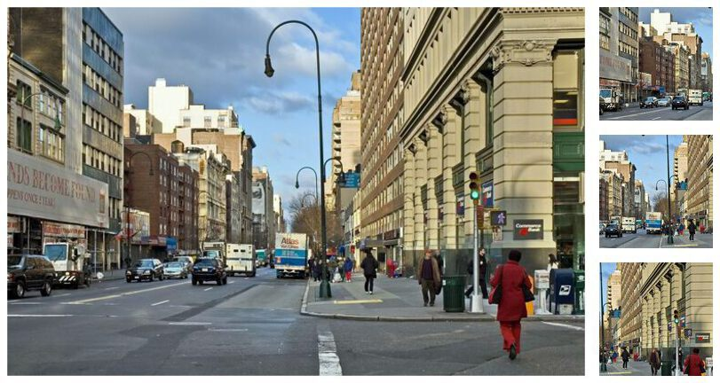

|                           |                           |                           |                           |
|:-------------------------:|:-------------------------:|:-------------------------:|:-------------------------:|
|  |  |  |
|                           | *Experimental Output - Nowhere, USA*                           |                           |

For a few months now, I've wanted to create something like [ThisPersonDoesNotExist](https://thispersondoesnotexist.com/) for street scenes. Luckily, the [AWS Deep Learning Challenge](https://amazon-ec2-dl1.devpost.com) gave me an excuse to do so at a small scale. At a high level, my project involved re-implementing elements of two foundational papers in generative computer vision and then training that model on 1.2 million street-level images.

It's not a novel idea, and I'm certainly no ML engineer, but enough work has been done in this field that I was able to read up on the literature, implement generative models, and reason about architectural and performance tradeoffs. The challenge encouraged participants to use AWS' `DL1` instances to scale deep learning model training on HPUs. So with that in mind, I wrote my code to train on both GPU and Gaudi accelerated instances, tried out several training strategies,and then did a comparative analysis of performance across training environments.

Regardless of why you're here, I'd recommend reading this page and seeing the gallery. Then viewing specific pages from the rest of this site if you're interested in [infrastructure and Gaudi processors](./infra.html), [machine learning](./ml.html), or [training your own GANs](./gan-training-notes.html).

Thanks for visiting! &mdash; DW

--------

## Theory

|                           |
|:-------------------------:|
| *Figure 1. DBGAN Generator Architecture -  As diagramed by Radford, et. al*|
|  |

In this project I re-implement elements of Ian Goodfellow's [Generative Adversarial Networks (2014)](https://proceedings.neurips.cc/paper/2014/file/5ca3e9b122f61f8f06494c97b1afccf3-Paper.pdf) 1  and Alec Radford's [Unsupervised Representation Learning With Deep Convolutional Generative Adversarial Networks (2016)](https://arxiv.org/pdf/1511.06434.pdf) 2  papers in PyTorch. Both papers are concerned with the development of GANs, Generative Adversarial Networks.

Before discussing specific elements of the project, let's discuss the *way* GANs work. Put simply, GANs consist of two competing functions. A generator (`G`) tries to create believable data and a discriminator (`D`) tries to maximize the probability it correctly classifies real and generated data.

<strong>Optional Math &mdash; Click to Expand</strong>

Assume the following variables:

- `X` &mdash; Input data, in our case, an image with size `(3 x 64 x 64)`
  
- `D(X)` or `D` &mdash; Discriminator network which outputs the probability that an input, `X`, is real.

- `G(Z)` or `G` &mdash; Generator network that deterministically creates data in the shape of `X`. In practice, an image with size `(3 x 64 x 64)`.
  
- `Z` &mdash; Random noise to seed the generator. In practice, a `(1 x 100)` vector drawn from a standard normal distribution.
  
- `D(G(Z))` &mdash; Given an output of the generator, the probability that the discriminator believes the image to be real. A high `D(G(Z))` suggests the generator has "tricked" the discriminator.

The critical steps in each training iteration involve measuring the values of the following terms. For the formula-inclined, the GAN is simply maximizing the following function:

`min​``G``max​``V``(D,G) = E``x∼pdata​(x)`​`[logD(x)] + E``z∼pz​(z)​``[log(1−D(G(z)))]`

- `E``x∼pdata​(x)`​`[logD(x)]` &mdash; The expected value of `D`'s predictions when given samples from the real batch. Remember, `D(x)` produces a probability, thus a perfect discriminator would return values near *0*.

- `E``z∼pz​(z)​``[log(1−D(G(z)))]` &mdash; The expected value of `D`'s prediction when given samples produced from `G(Z)`, Because all images in this batch are fake, a better discriminator would predict a lower `D(G(Z))`, also returning values near *0*.

In the DCGAN paper, both functions are convolutional neural networks with a specific layer structure. In my implementation, I kept the same form and layer structure of *Radford's* original architecture, but modified the size of the feature maps and input vectors to ensure model stability. Please see [modeling choices](./ml.html) for more detail on the specific implementation details of the model.

--------

## Mapillary Street Level Imagery Data

|                           |
|:-------------------------:|
| *Figure 2. Training Samples From MSLS - Cropped and Transformed*|
|  |

Throughout this project, I used Mapillary's Street-Level Sequences data (MSLS). Mapillary provides a platform for crowd-sourced maps and street-level imagery, and publishes computer vision research using data collected from this platform. Mapillary has made this and other data publicly available for [download](https://www.mapillary.com/dataset/places) (**Note**: [GH Issue](https://github.com/mapillary/mapillary_sls/issues/23)). In total, MSLS contains 1.6 million images from 30 major cities on six-continents and covers different seasons, weather, daylight conditions, structural settings, etc. The models discussed in this post here was trained on a sample of ~1.2 million images with geographic distribution shown below. The remaining images were reserved for hyperparameter tuning, cross-validation, model evaluation, etc. In total, the training data was about 45GB, just a bit too large to fit in the GPU memory of the tested training instances.

<strong>Table 1.1 — Count of Mapillary Training Images By Metro Area &mdash; Click To Expand</strong>

| Metro Area    | % of Sample | Approx. Count |
|:--------------|:-----------:|----------:|
| Amman         |       0.14% |     1,702 |
| Amsterdam     |       1.37% |    16,487 |
| Austin        |       1.90% |    22,847 |
| Bangkok       |       3.26% |    39,055 |
| Boston        |       1.27% |    15,204 |
| Budapest      |      17.67% |   212,015 |
| Goa           |       1.11% |    13,307 |
| Helsinki      |       1.75% |    20,978 |
| London        |       0.65% |     7,755 |
| Manila        |       0.53% |     6,416 |
| Melbourne     |      15.58% |   186,908 |
| Moscow        |      18.14% |   217,594 |
| Nairobi       |       0.06% |       725 |
| Ottawa        |      12.09% |   145,063 |
| Paris         |       1.62% |    19,416 |
| Phoenix       |      12.56% |   150,642 |
| Sao Paulo     |       4.65% |    55,793 |
| San Fransisco |       0.43% |     5,133 |
| Tokyo         |       3.49% |    41,845 |
| Toronto       |       1.27% |    15,176 |
| Trondheim     |       1.07% |    12,888 |
| Zurich        |       0.51% |     6,081 |
| **Total**     |             | **1,199,556** |
Table: *Table 1 &mdash; Count of Mapillary Training Images By Metro Area*

Because the authors who developed MSLS for their [research](https://research.mapillary.com/publication/cvpr20c) 3  were specifically interested in place-recognition,the data is organized such that images of the same physical location appear multiple times under different conditions. The images from these sequences are very highly correlated and reduce the diversity of the training set far more than a single repeated image. The effect of multi-image sequences was reduced by applying random transformations on each image. MSLS contains images up to `(3 x 640 x 480)`. Because the model expects `(3 x 64 x 64)` images, I had leeway to apply cropping, down-scaling, and horizontal translations to all images before passing them through the network. Given the large image shown below, the model could receive any of the variations presented on the right.

|                                                                          |
|:------------------------------------------------------------------------:|
| *Figure 3.1 Sample DataLoader Image Transformations - 128px* 4  |
|            |

--------

## DCGAN Results

--------

## References

**1** *"Generative Adversarial Networks." Ian J. Goodfellow, Jean Pouget-Abadie, Mehdi Mirza, Bing Xu, David Warde-Farley, Sherjil Ozair, Aaron Courville, Yoshua Bengio. ArXiv 2014.*

**2** *Radford, Alec, Luke Metz, and Soumith Chintala. "Unsupervised representation learning with deep convolutional generative adversarial networks." arXiv preprint arXiv:1511.06434 (2015).*

**3** *F. Warburg, S. Hauberg, M. Lopez-Antequera, P. Gargallo, Y. Kuang, and J. Civera. Mapillary Street-Level Sequences: A Dataset for Lifelong Place Recognition. In Conference on Computer Vision and Pattern Recognition (CVPR), 2020*

**4** *File:NYC 14th Street looking west 12 2005.jpg. (2020, September 13). Wikimedia Commons, the free media repository. Retrieved 23:09, January 25, 2022 from https://commons.wikimedia.org/w/index.php?title=File:NYC_14th_Street_looking_west_12_2005.jpg&oldid=457344851* 
