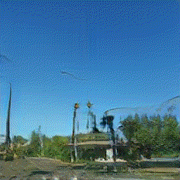
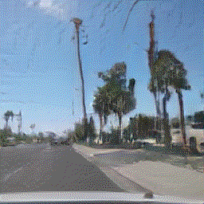
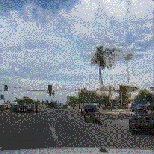
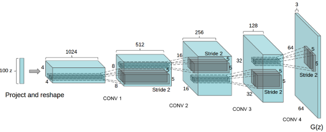
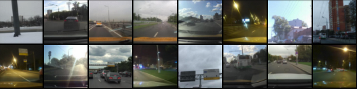
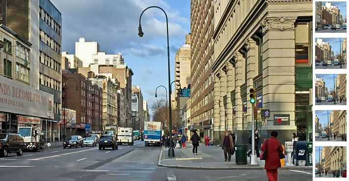
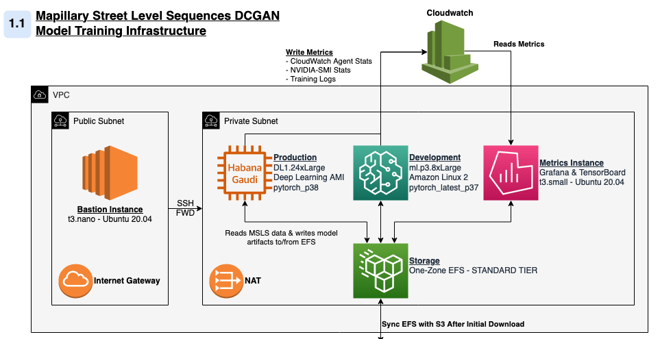

    <figure class="image">
        
        
        
        <i><figcaption style="font-size: 12px;">Nowhere, USA - Experimental Output - Scenes created by interpolating between sequences of generated frames</figcaption></i>
    </figure>

For a few months now, I've wanted to create something like [ThisPersonDoesNotExist](https://thispersondoesnotexist.com/) for street scenes. Luckily, the [AWS Deep Learning Challenge](https://amazon-ec2-dl1.devpost.com) gave me an excuse to do so at a small scale. At a high level, my project involved re-implementing elements of two foundational papers in generative computer vision and then training that model on 1.2 million street-level images.

It's not a novel idea, but enough work has been done in this field that I was able to read up on the literature, implement generative models, and reason about architectural and performance tradeoffs. The challenge encouraged participants to use AWS' `DL1` instances to scale deep learning model training on HPUs. With that in mind, I instrumented my code to train on both GPU and Gaudi accelerators, tried out several training strategies, and then did a comparative analysis of performance across training environments.

- [Theory and Background](#Theory-and-Background)
- [Mapillary Street Level Imagery Data](#Mapillary-Street-Level-Imagery-Data)
- [AWS System Architecture](#AWS-System-Architecture)
- [DCGAN Results](#DCGAN-Results)
- [References](#References)

--------

## Theory and Background

In this project I re-implement elements of Ian Goodfellow's [Generative Adversarial Networks (2014)](https://proceedings.neurips.cc/paper/2014/file/5ca3e9b122f61f8f06494c97b1afccf3-Paper.pdf)1 and Alec Radford's [Unsupervised Representation Learning With Deep Convolutional Generative Adversarial Networks (2016)](https://arxiv.org/pdf/1511.06434.pdf)2 papers in PyTorch. Both papers are concerned with the development of GANs, Generative Adversarial Networks.

Before discussing specific elements of the project, let's discuss the *way* GANs work. Put simply, GANs consist of two competing functions. A generator (`G`) tries to create believable data and a discriminator (`D`) tries to maximize the probability it correctly classifies real and generated data.

**Assume the following variables:**

- `X` &mdash; Input data, in our case, an image with size `(3 x 64 x 64)`
  
- `D(X)` or `D` &mdash; Discriminator network which outputs the probability that an input, `X`, is real.

- `G(Z)` or `G` &mdash; Generator network that deterministically creates data in the shape of `X`. In practice, an image with size `(3 x 64 x 64)`.
  
- `Z` &mdash; Random noise to seed the generator. In practice, a `(1 x 100)` vector drawn from a standard normal distribution.
  
- `D(G(Z))` &mdash; Given an output of the generator, the probability that the discriminator believes the image to be real. A high `D(G(Z))` suggests the generator has "tricked" the discriminator.

The critical steps in each training iteration involve measuring the values of the following terms. For the formula-inclined, the GAN is simply maximizing the following function:

`min​``G``max​``V``(D,G) = E``x∼pdata​(x)`​`[logD(x)] + E``z∼pz​(z)​``[log(1−D(G(z)))]`

- `E``x∼pdata​(x)`​`[logD(x)]` &mdash; The expected value of `D`'s predictions when given samples from the real batch. Remember, `D(x)` produces a probability, thus a perfect discriminator would return values near *0*.

- `E``z∼pz​(z)​``[log(1−D(G(z)))]` &mdash; The expected value of `D`'s prediction when given samples produced from `G(Z)`, Because all images in this batch are fake, a better discriminator would predict a lower `D(G(Z))`, also returning values near *0*.

In the DCGAN paper, the method by which this function is maximized is by putting batches of images through `D` and `G`, where both functions are convolutional neural networks with a specific layer structure.

    <figure>
        
        <i><figcaption style="font-size: 12px;">Figure 1. DBGAN Generator Architecture -  As diagramed by Radford, et. al 4</figcaption></i>
    <figure>

In my implementation, I kept the same form and layer structure of *Radford's* original architecture, but modified the size of the feature maps and input vectors to ensure model stability. Please see [modeling choices](./ml.html) for more detail on the specific implementation details of the model.

--------

## Mapillary Street Level Imagery Data

    <figure>
    
    <i><figcaption style="font-size: 12px;" >Figure 2. Training Samples From MSLS - Cropped and Transformed</figcaption></i>
    <figure>

Throughout this project, I used Mapillary's Street-Level Sequences data (MSLS). Mapillary provides a platform for crowd-sourced maps and street-level imagery, and publishes computer vision research using data collected from this platform. Mapillary has made this and other data publicly available for [download](https://www.mapillary.com/dataset/places) (**Note**: [GH Issue](https://github.com/mapillary/mapillary_sls/issues/23)). In total, MSLS contains 1.6 million images from 30 major cities on six-continents and covers different seasons, weather, daylight conditions, structural settings, etc. The models discussed in this post here was trained on a sample of ~1.2 million images with geographic distribution shown below. The remaining images were reserved for hyperparameter tuning, cross-validation, model evaluation, etc. In total, the training data was about 45GB, just a bit too large to fit in the GPU memory of most less-expensive training instances.

| Metro Area    | % of Sample | Approx. Count |
|:--------------|:-----------:|----------:|
| Amman         |       0.14% |     1,702 |
| Amsterdam     |       1.37% |    16,487 |
| Austin        |       1.90% |    22,847 |
| Bangkok       |       3.26% |    39,055 |
| Boston        |       1.27% |    15,204 |
| Budapest      |      17.67% |   212,015 |
| Goa           |       1.11% |    13,307 |
| Helsinki      |       1.75% |    20,978 |
| London        |       0.65% |     7,755 |
| Manila        |       0.53% |     6,416 |
| Melbourne     |      15.58% |   186,908 |
| Moscow        |      18.14% |   217,594 |
| Nairobi       |       0.06% |       725 |
| Ottawa        |      12.09% |   145,063 |
| Paris         |       1.62% |    19,416 |
| Phoenix       |      12.56% |   150,642 |
| Sao Paulo     |       4.65% |    55,793 |
| San Fransisco |       0.43% |     5,133 |
| Tokyo         |       3.49% |    41,845 |
| Toronto       |       1.27% |    15,176 |
| Trondheim     |       1.07% |    12,888 |
| Zurich        |       0.51% |     6,081 |
| **Total**     |             | **1,199,556** |
Table: Table 1 &mdash; Count of Mapillary Training Images By Metro Area

Because the authors who developed MSLS for their [research](https://research.mapillary.com/publication/cvpr20c)3 were specifically interested in place-recognition,the data is organized such that images of the same physical location appear multiple times under different conditions. The images from these sequences are very highly correlated and reduce the diversity of the training set far more than a single repeated image. The effect of multi-image sequences was reduced by applying random transformations on each image. MSLS contains images up to `(3 x 640 x 480)`. Because the model expects `(3 x 64 x 64)` images, I had leeway to apply cropping, down-scaling, and horizontal translations to all images before passing them through the network. Given the large image shown below, the model could receive any of the variations presented on the right.

    <figure>
    
    <i><figcaption style="font-size: 12px;"> Figure 3. Sample DataLoader Image Transformations4 </figcaption></i>
    <figure>

--------

## AWS System Architecture

    <figure>
    
    <i><figcaption style="font-size: 12px;" >Simplified Model Training Architecture</figcaption></i>
    <figure>

All infrastructure for this project is hosted on AWS. Please see [infrastructure and hardware choices](./infra.html) for more detail on the specific details of that element of the project.

All training resources run in a single VPC with two subnets (1 public, 1 private) in the same availability zone. I deployed the following instances to the VPC's private subnet and accessed them via SSH through a jump-instance deployed to the public subnet.

- **training-prod** &mdash; An EC2 instance for running deep learning models, either `DL1` or a cost-comparable GPU instance (`P`-type). In either case, the instance is running a variant of the AWS Deep Learning AMI. Of course, you can construct your own conda environment, container, or AMI for your specific needs.
  
- **training-nb** &mdash; A small SageMaker instance used for interactive model development, model evaluation, and generating plots.
  
- **metrics** &mdash; A small EC2 instance used to host metrics containers. Most charts in the infrastructure, performance, and profiling section come off of these applications. Specifically, this machine ran:
  - [Tensorboard](https://www.tensorflow.org/tensorboard) &mdash; A tool for visualizing *machine learning metrcs* during training.
  - [Grafana](https://grafana.com/) &mdash; An analytics and monitoring tool. I configured Grafana to visualize *machine-level* metrics from our training instances.

Each of these instances has access to an AWS Elastic Filesystem (EFS) for saving model data (e.g. checkpoints, plots, traces, etc.). Using EFS saved me hours of data transfer in development and allowed me to pass model checkpoints between machines (i.e. between *training-prod* and *training-nb*). However, because EFS can be quite slow compared to EBS or local storage, the actual training data was saved to a `gp3` volume attached to my training instances and then passed to the GPU/HPU during training.

--------

## DCGAN Results

--------

## References

**1** *"Generative Adversarial Networks." Ian J. Goodfellow, Jean Pouget-Abadie, Mehdi Mirza, Bing Xu, David Warde-Farley, Sherjil Ozair, Aaron Courville, Yoshua Bengio. ArXiv 2014.*

**2** *Radford, Alec, Luke Metz, and Soumith Chintala. "Unsupervised representation learning with deep convolutional generative adversarial networks." arXiv preprint arXiv:1511.06434 (2015).*

**3** *F. Warburg, S. Hauberg, M. Lopez-Antequera, P. Gargallo, Y. Kuang, and J. Civera. Mapillary Street-Level Sequences: A Dataset for Lifelong Place Recognition. In Conference on Computer Vision and Pattern Recognition (CVPR), 2020*

**4** *File:NYC 14th Street looking west 12 2005.jpg. (2020, September 13). Wikimedia Commons, the free media repository. Retrieved 23:09, January 25, 2022 from https://commons.wikimedia.org/w/index.php?title=File:NYC_14th_Street_looking_west_12_2005.jpg&oldid=457344851* 
