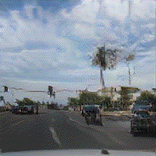
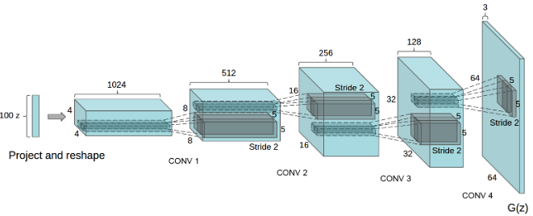

--------

<center>
    <figure class="image">
        
        
        
        <i><figcaption style="font-size: 12px;">Nowhere, USA - Experimental Output - Scenes created by interpolating between sequences of generated frames</figcaption></i>
    </figure>
</center>

This post is a companion to my entry in the [AWS Deep Learning Challenge](https://amazon-ec2-dl1.devpost.com). The event encouraged participants to use AWS' DL1 instances to scale deep learning model training. I'm not much of an ML engineer, but this event offered a perfect opportunity to implement a model, instrument my code to train on [Gaudi accelerators](https://habana.ai/wp-content/uploads/2019/06/Habana-Gaudi-Training-Platform-whitepaper.pdf), and then perform a comparative analysis of performance across training environments. At a high level, my project involved re-implementing elements of foundational papers in the study of generative computer vision and then training a model on over 1.5 million street-level images.

- [Theory and Background](#Theory-and-Background)
- [Mapillary Street Level Imagery Data](#Mapillary-Street-Level-Imagery-Data)
- [AWS System Architecture](#AWS-System-Architecture)
- [Modifications for Training on Gaudi Accelerated Instances (`DL1`)](#Modifications-for-Training-on-Gaudi-Accelerated-Instances-DL1)
- [DCGAN Results](#DCGAN-Results)
- [Comparative Performance](#Comparative-Performance)
- [Appendix 1 - Comparable Instance Selection](#Appendix-1---Comparable-Instance-Selection)
- [Citations](#Citations)

--------

### Theory and Background

In this project I re-implement elements of Ian Goodfellow's [Generative Adversarial Networks (2014)](https://proceedings.neurips.cc/paper/2014/file/5ca3e9b122f61f8f06494c97b1afccf3-Paper.pdf)<sup>1</sup> and Alec Radford's [Unsupervised Representation Learning With Deep Convolutional Generative Adversarial Networks (2016)](https://arxiv.org/pdf/1511.06434.pdf)<sup>2</sup> papers in PyTorch. Both papers are concerned with the development of GANs,Generative Adversarial Networks.

Before discussing specific elements of the project, let's discuss the *way* GANs work. Put simply, GANs consist of two competing functions. A generator (`G`) tries to create believable data and a discriminator (`D`) tries to maximize the probability it correctly classifies real and generated data.

**Assume the following variables:**

- `X` &mdash; Input data, in our case, an image with size `(3 x 64 x 64)`
  
- `D(X)` or `D` &mdash; Discriminator network which outputs the probability that an input, `X`, is real.

- `G(Z)` or `G` &mdash; Generator network that deterministically creates data in the shape of `X`. In practice, an image with size `(3 x 64 x 64)`.
  
- `Z` &mdash; Random noise to seed the generator. In practice, a `(1 x 100)` vector drawn from a standard normal distribution.
  
- `D(G(Z))` &mdash; Given an output of the generator, the probability that the discriminator believes the image to be real. A high `D(G(Z))` suggests the generator has "tricked" the discriminator.

Overall, our GAN is trying to maximize the sum of the two terms. The critical steps in each training iteration involve measuring the values of the following terms. For the formula-inclined, the GAN is simply maximizing the following function:

<center>`min​`<sub>`G`</sub>`max​`<sub>`V`</sub>`(D,G) = E`<sub>`x∼pdata​(x)`</sub>​`[logD(x)] + E`<sub>`z∼pz​(z)​`</sub>`[log(1−D(G(z)))]`</center>

- `E`<sub>`x∼pdata​(x)`</sub>​`[logD(x)]` &mdash; The expected value of `D`'s predictions when given samples from the real batch. Remember, `D(x)` produces a probability, thus a perfect discriminator would return values near *0*.

- `E`<sub>`z∼pz​(z)​`</sub>`[log(1−D(G(z)))]` &mdash; The expected value of `D`'s prediction when given samples produced from `G(Z)`, Because all images in this batch are fake, a better discriminator would predict a lower `D(G(Z))`, also returning values near *0*.

In the DCGAN paper, the method by which this function is maximized is by putting batches of images through `D` and `G`, where both are convolutional neural networks with a specific layer structure. My implementation replicates the architecture of both networks presented in *Radford et. al.*:

<center>
    <figure>
        
        <i><figcaption style="font-size: 12px;">DBGAN Architecture - As diagramed by Radford, et. al <sup>4<sup></figcaption></i>
    <figure>
</center>

At a low-level, it's difficult to describe all of the internal consequences of using `PyTorch` rather than the specific packages the authors used. At a high level, I made the following notable changes:

- Choose `AdamW`/`FusedAdamW` as an optimizer function over `SGD`. *Goodfellow, et al.* use a custom `SGD` [implementation](https://github.com/goodfeli/adversarial/blob/master/sgd.py) that is a patched version of pylearn2's `SGD`. Instead, I elected for a built-in PyTorch optimizer, `AdamW`. As an added benefit, Habana offers their own `FusedAdamW` implementation that should perform quite well on the Gaudi instances.

- In *Goodfellow, et al.*, the authors "Estimate probability of the test set data by fitting a gaussian parzen window to the samples generated with G and reporting the log-likelihood under this distribution". The paper implements multiple generative methods and applies this procedure to evaluate the relative performance of each. Rather than using this procedure to evaluate other models, I implemented it for comparing intra-model progress across epochs, see [results](#DCGAN-Results) for a deeper discussion of model validation.

--------

### Mapillary Street Level Imagery Data

<center>
    <figure>
    
    <i><figcaption style="font-size: 12px;" >Training Samples From MSLS - Cropped and Transformed</figcaption></i>
    <figure>
</center>

Throughout this project, I used Mapillary's Street-Level Sequences data (MSLS). Mapillary provides a platform for crowd-sourced maps and street-level imagery, and publishes computer vision research using data collected from this platform. Mapillary has made this and other data publicly available for [download](https://www.mapillary.com/dataset/places). In total, MSLS contains 1.6 million images from 30 major cities on six-continents and covers different seasons, weather, daylight conditions, structural settings, etc.

The model presented here was trained on a sample of ~940,000 images. The remaining images were reserved for hyperparameter tuning, cross-validation, model evaluation, etc. The figure below shows an estimated count of images included in model training.

```bash
# Training Sample By Metro Area
| Amman     |  1,811 |   | London    |   5,983 |   | Toronto   |  12,802 |
| Amsterdam |  7,908 |   | Manila    |   5,378 |   | Trondheim |   9,154 |
| Austin    | 28,462 |   | Melbourne | 189,945 |   | Kampala   |   2,069 |
| Bangkok   | 40,125 |   | Moscow    | 171,878 |   | Paris     |   9,503 |
| Boston    | 14,037 |   | Nairobi   |     887 |   | Phoenix   | 156,477 |
| Goa       |  5,735 |   | SF        |   4,525 |   | Zurich    |   2,991 |
| Budapest  | 45,800 |   | Ottawa    | 123,296 |   | Sao Paulo |  54,098 |
| Helsinki  | 15,228 |   | Tokyo     |  34,836 |   | Total     | 942,928 |
```

Because the authors who developed MSLS for their [research](https://research.mapillary.com/publication/cvpr20c)<sup>3</sup> were specifically interested in place-recognition, the data is organized such that images of the same physical location appear multiple times under different conditions. The images from these sequences are very highly correlated and reduce the diversity of the training set far more than a single repeated image.

Originally, I was hoping to train a suite of metro-area models, but the effect of individual sequences was too pronounced and the model often reproduced images from the training set. I did some custom filtering to reduce the contribution of individual sequences, but found the most effective strategy was simply adding more metropolitan areas and converging on a single model.

The effect of multi-image sequences was further reduced by applying random transformations on each image. MSLS contains images up to `(3 x 640 x 480)`. Because the original DCGAN paper expects `(3 x 64 x 64)` images, I had leeway to apply cropping, down-scaling, and horizontal translations to all images before passing them through the model. Given the large image shown below, the model could receive any of the variations presented on the right.

<center>
    <figure>
    
    <i><figcaption style="font-size: 12px;" >Sample Transformations - All images are shifted, center-cropped, and then scaled to `3 x 64 x 64`<sup>4</sup> </figcaption></i>
    <figure>
</center>

--------

### AWS System Architecture

<center>
    <figure>
    
    <i><figcaption style="font-size: 12px;" >Simplified Model Training Architecture</figcaption></i>
    <figure>
</center>

All infrastructure for this project is hosted on AWS. If you'd like a user-guide for deploying the architecture yourself, I'd direct you to my infrastructure repo, [msls-infra](https://github.com/DMW2151/msls-infra).

All training resources run in a single VPC with two subnets (1 public, 1 private) in the same availability zone. Note that `DL1` and `P3` instances are not available in all regions and zones. For me, `us-east-1a` was satisfactory, but this is not uniform across [accounts](https://aws.amazon.com/premiumsupport/knowledge-center/vpc-map-cross-account-availability-zones/). I deployed the following instances to the VPC's private subnet and accessed them via SSH through a jump-instance deployed to the public subnet.
  
- **training-prod** &mdash; A model training instance, either `DL1` or a cost-comparable GPU instance (`P`-type).
  
- **training-nb** &mdash; A small Sagemaker instance used for interactive model development, model evaluation, and generating plots.
  
- **metrics** &mdash; A small instance used to host metrics containers. This machine ran:
  - [Tensorboard](https://www.tensorflow.org/tensorboard) &mdash; a tool for visualizing *machine learning metrcs* during training.
  - [Grafana](https://grafana.com/) &mdash; an analytics and monitoring tool. I configured Grafana to visualize *machine-level* metrics from our training instances.

Each of these instances had shared access to an AWS Elastic Filesystem (EFS) with MSLS data. Using a shared filesystem saved me hours of data transfer in development and allowed me to pass model checkpoints between machines (i.e. between *training-prod* and *training-nb*). Of course, EFS is slower than NVME EBS volumes, but because the data (~40GB) fits comfortably in memory of our training instances (almost on a single Gaudi accelerator!) I didn't anticipate this being a bottleneck after the initial load.

--------

### Modifications for Training on Gaudi Accelerated Instances (`DL1`)

I started with a standard PyTorch model running on the GPU before instrumenting it with the code to run on the HPU. Migrating a model to run on HPUs require some changes, most of which are highlighted in the migration [guide](https://docs.habana.ai/en/latest/Migration_Guide/Migration_Guide.html#porting-simple-pyt-model). In general, a few changed imports allow the PyTorch Habana bridge to drive the execution of deep learning models on the Habana Gaudi device. Specifically, I made the following changes for the Gaudi accelerated instances:

- Swap out a standard `pytorch.DataLoader` for `habana_dataloader.HabanaDataLoader`. Under the right [circumstances](https://docs.habana.ai/en/v1.1.0/PyTorch_User_Guide/PyTorch_User_Guide.html#habana-data-loader), `HabanaDataLoader` can yield better performance that the native `DataLoader`. Even without acceleration, I can still use the `HabanaDataLoader` with a high `num_workers` parameter to quickly shuttle data onto the device.
  
- Use `Lazy Mode`. [Lazy Mode](https://docs.habana.ai/en/v1.1.0/PyTorch_User_Guide/PyTorch_User_Guide.html#lazy-mode) provides the SynapseAI graph compiler the opportunity to optimize the device execution for multiple ops.
  
- Use `FusedAdamW` over `AdamW`. `FusedAdamW` can batch the element-wise updates applied to all the model’s parameters into one or a few kernel launches rather than a single kernel for each parameter. This is a custom optimizer for Habana devices and should yield some performance improvements over `AdamW`.

--------

### DCGAN Results

TBD

--------

### Comparative Performance

TBD

--------

### Appendix 1 - Comparable Instance Selection

Using [instances.vantage.sh](https://instances.vantage.sh/) and `aws describe-instances`, I aggregated data for all EC2 instances available in `us-east-1` with between 2 and 8 GPUs. These machines range from those with GPUs that are designed for graphics workloads (e.g. `G3` instances with Tesla M60s) to top-of-the line training instances (e.g. `P4` instances with Ampere 100s). There are many sources that publish GPU performance statistics, but for this comparison I elected to rely exclusively on Nvidia's most recent [benchmarks](https://developer.nvidia.com/deep-learning-performance-training-inference)

| API Name      | Memory (GiB) | VCPUs | GPUs | GPU Model             | GPU Mem (GiB) | USD/Hr |
|---------------|--------------|-------|------|-----------------------|---------------|--------|
| g3.8xlarge    |          244 |    32 |    2 | NVIDIA Tesla M60      |            16 |  $2.28 |
| g3.16xlarge   |          488 |    64 |    4 | NVIDIA Tesla M60      |            32 |  $4.56 |
| p2.8xlarge    |          488 |    32 |    8 | NVIDIA Tesla K80      |            96 |  $7.20 |
| g4dn.12xlarge |          192 |    48 |    4 | NVIDIA T4 Tensor Core |            64 |  $3.91 |
| g4dn.metal    |          384 |    96 |    8 | NVIDIA T4 Tensor Core |           128 |  $7.82 |
| g5.12xlarge   |          192 |    48 |    4 | NVIDIA A10G           |            96 |  $5.67 |
| g5.24xlarge   |          384 |    96 |    4 | NVIDIA A10G           |            96 |  $8.14 |
| g5.48xlarge   |          768 |   192 |    8 | NVIDIA A10G           |           192 | $16.29 |
| p3.8xlarge    |          244 |    32 |    4 | NVIDIA Tesla V100     |            64 | $12.24 |
| p3.16xlarge   |          488 |    64 |    8 | NVIDIA Tesla V100     |           128 | $24.48 |
| p3dn.24xlarge |          768 |    96 |    8 | NVIDIA Tesla V100     |           256 | $31.21 |
| p4d.24xlarge  |         1152 |    96 |    8 | NVIDIA A100           |           320 | $32.77 |
Table: Table A.1.1 - Possible Comparable GPU Instances

Of the instances listed in *Table A.1.1*, I chose the following for comparison tests against the `DL1`. On price, `p3.8xlarge` is the most similar to the `DL1` and offers 4 `V100`s, this instance class would be an uncontroversial choice for model training under most conditions. I also wanted to test the `g4dn.12xlarge` instances. The `T4` is a, decidedly less powerful contemporary of the `V100`. Because these are very low cost units and I'm not sensitive to time-to-train, I wanted to experiment with these as well.

| API Name      | Memory (GiB) | VCPUs | GPUs | GPU Model             | GPU Mem (GiB) | USD/Hr |
|---------------|--------------|-------|------|-----------------------|---------------|--------|
| g4dn.12xlarge |          192 |    48 |    4 | NVIDIA T4 Tensor Core |            64 |  $3.91 |
| p3.8xlarge    |          244 |    32 |    4 | NVIDIA Tesla V100     |            64 | $12.24 |
Table: Table A.1.2 - GPU Instances Evaluated

### Citations

**<sup>1</sup>** *"Generative Adversarial Networks." Ian J. Goodfellow, Jean Pouget-Abadie, Mehdi Mirza, Bing Xu, David Warde-Farley, Sherjil Ozair, Aaron Courville, Yoshua Bengio. ArXiv 2014.*

**<sup>2</sup>** *Radford, Alec, Luke Metz, and Soumith Chintala. "Unsupervised representation learning with deep convolutional generative adversarial networks." arXiv preprint arXiv:1511.06434 (2015).*

**<sup>3</sup>** *F. Warburg, S. Hauberg, M. Lopez-Antequera, P. Gargallo, Y. Kuang, and J. Civera. Mapillary Street-Level Sequences: A Dataset for Lifelong Place Recognition. In Conference on Computer Vision and Pattern Recognition (CVPR), 2020*

**<sup>4</sup>** *File:NYC 14th Street looking west 12 2005.jpg. (2020, September 13). Wikimedia Commons, the free media repository. Retrieved 23:09, January 25, 2022 from https://commons.wikimedia.org/w/index.php?title=File:NYC_14th_Street_looking_west_12_2005.jpg&oldid=457344851* 
